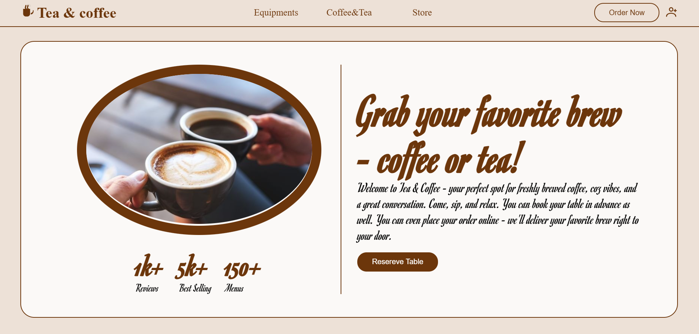

# ☕ Tea & Coffee Landing Page

  A modern and visually appealing landing page dedicated to tea and coffee lovers. This project highlights a calming design, smooth scrolling animations, and a responsive layout that works beautifully on all devices.

## 🚀 Features

  - 🍵 Elegant Design: Aesthetic layout with warm tones and rich visuals of tea and coffee.

  - 🌿 Responsive Layout: Works seamlessly on mobile, tablet, and desktop.

  - ✨ Smooth Animations: Uses AOS (Animate On Scroll) for engaging transitions.

  - 📖 Stories Section: Showcases short narratives to make the page more relatable and inviting.

  - 🧭 Easy Navigation: Clean menu bar with smooth scrolling between sections.

## 🛠️ Tech Stack

  - HTML5

  - CSS3

  - JavaScript

  - AOS (Animate On Scroll)

## 🧑‍💻 How to Use

1. Clone the repository

    ```bash

    git clone https://github.com/Harsimrankaur2004/teaAndcoffee.git


2. Navigate to the folder

    ```bash

    cd tea-and-coffee


3. Open the project
   Just open index.html in your browser.

## 🌐 Live Demo

👉 [Click here to open the website](https://tea-and-coffee.netlify.app/)

## 📸 Screenshot

  

## 📜 License

   This project is licensed under the MIT License — you’re free to use and modify it.

   [](https://opensource.org/licenses/MIT)